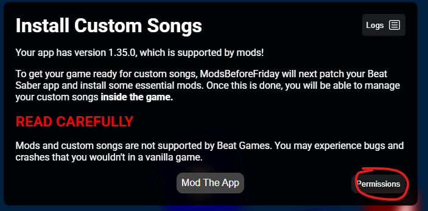
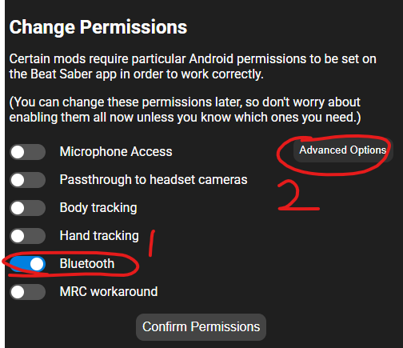
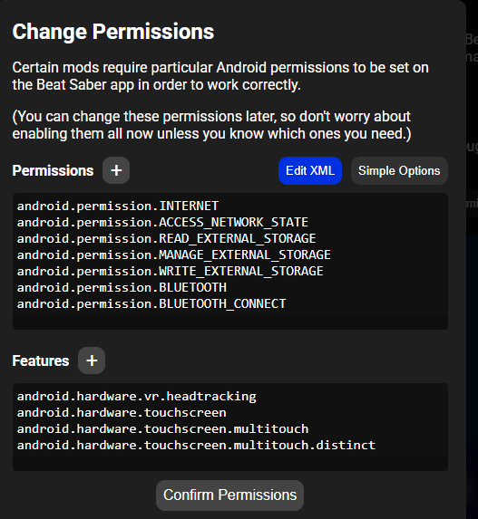
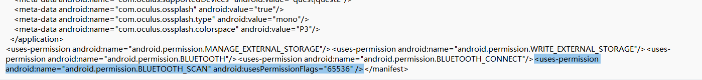
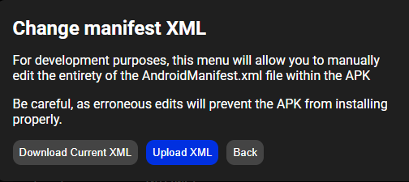
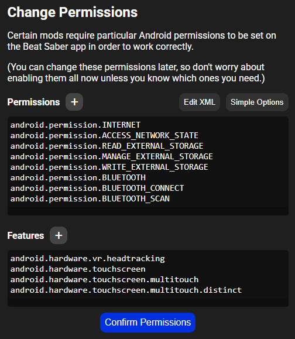
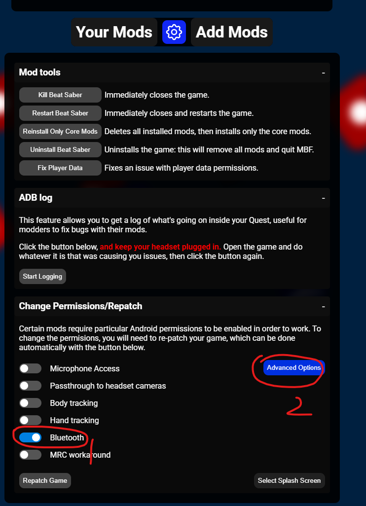
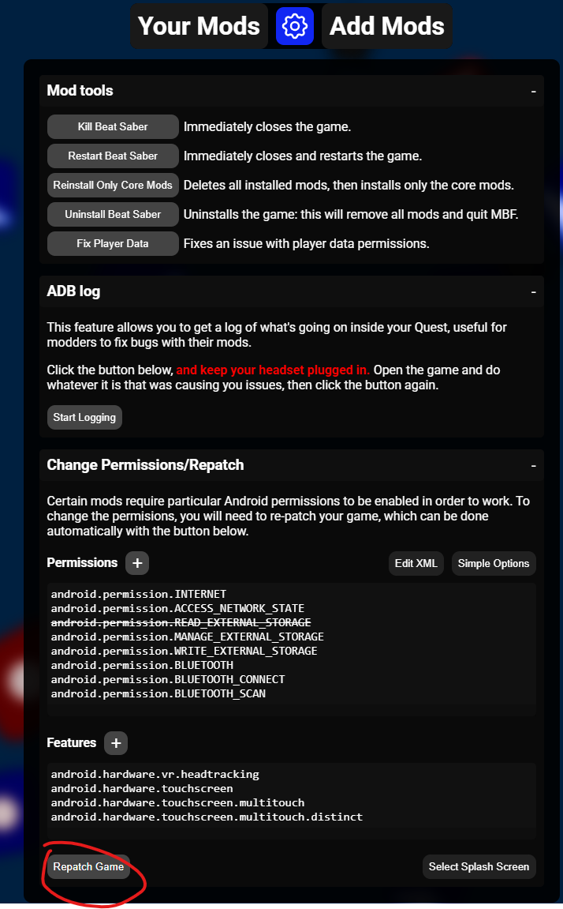

# Bluetooth permission Guide for MBF

If you want connect your bluetooth heart rate device with your game directly, follow this guide.

There are two way for MBF to patch the bluetooth permission. The first is setup permission before patch the game. The seconed is repatch the permission after you patch the game.

>If you just turn on Bluetooth permission, the mod will likely works but only for PAIRED bluetooth devices.  
If you continue with this guide, the mod will be able to connect your hr device without a bluetooth pair. This is recommand setup. **Please unpair your heart rate device from quest OS if you follow this guide. No pair required.**

If you just installed a new game, follow next section. If your game already installed, follow [this](#repatch-an-already-moded-game)

## Setup with a new game install

Before you patch the game with MBF, you can enable the bluetooth permission toggle. Then MBF will patch the bluetooth for you.



Turn on the bluetooth permission. And then Click the `Advanced Options` button.




Continue read the next section.

### Edit XML Guide

Click `Edit XML`



Click `Download Current XML`.


Right click the file you just downloaded, and click `edit`.

Copy the following text to the xml file. Please look at the following picture.
```xml
<uses-permission android:name="android.permission.BLUETOOTH_SCAN" android:usesPermissionFlags="65536" />
```



Save the xml file, and then click `Upload XML` and select the file you just edited.



Then click `Confirm Permission`.



And click `Mod The App` as a normal MBF setup.

## Repatch an already moded game

You can setup the permission at here.



Then you need click `Edit XML`. This process is same with the first setup. Please look at the guide above [Edit xml](#Edit-XML-Guide).


After you complete the XML patch, click the `Repatch Game` button.

