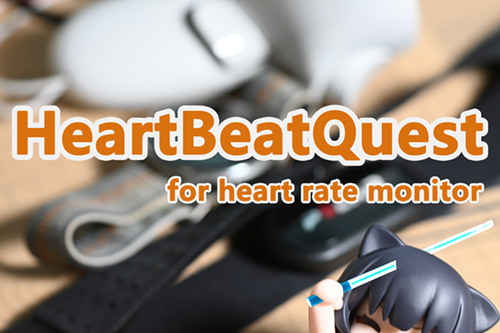

# HeartBeatQuest - Quest 版 BeatSaber 心率模组

 

> [!TIP]
> 本模组仅适用于 Quest 平台。PC 版请使用 [HRCounter](https://github.com/qe201020335/HRCounter)。

在 Beat Saber 游戏内实时显示你的心率数据。

# 快速使用

使用 [MBF](https://mbf.bsquest.xyz/) 安装并打补丁（可选蓝牙权限），进入游戏后点击左侧按钮打开模组设置。选择数据源后重启游戏即可。

> [!WARNING]
> **QuestPatcher 中文版不支持蓝牙权限补丁。** 如需使用蓝牙数据源，请使用 MBF。

> [!NOTE]
> **心率录制**  
> 如果检测到 BeatLeader-qmod，本模组会自动将心率数据写入 BeatLeader 的回放文件。可在模组设置中关闭此功能。

> [!TIP]
> **功能建议**  
> 欢迎在 Issues 中提出建议！

# 数据源

## 蓝牙

直接连接你的 BLE 心率设备。延迟最低。

1. 在 [MBF](https://mbf.bsquest.xyz/) 中给游戏打上蓝牙权限补丁。
2. 安装本模组。
3. 按 [蓝牙权限指南](ModsBeforeFridayGuide/BLE.cn.md) 操作则**无需配对**；否则需在 Quest 系统蓝牙设置中配对心率设备。
4. 打开游戏，扫描并选择设备。

> [!NOTE]
> 不使用蓝牙数据源则无需任何蓝牙权限。

详细步骤：[蓝牙权限指南](ModsBeforeFridayGuide/BLE.cn.md)

## HypeRate

无需蓝牙权限。在手机上安装 [HypeRate](https://www.hyperate.io/) APP，模组中选择 HypeRate 数据源并重启，然后在设置中输入你的 HypeRate ID 即可。

数据通过 Cloudflare 服务器转发。详见 [HypeRate 文档（英文）](Readme.hyperate.md)。

## Pulsoid

无需蓝牙权限。在手机上安装 [Pulsoid](https://pulsoid.net/) APP，模组中选择 Pulsoid 数据源并重启，然后在设置中登录账号或输入 Token。

Pulsoid 为直连方式，网络状况可能影响使用。详见 [Pulsoid 文档（英文）](Readme.pulsoid.md)。

## OSC

无需蓝牙权限。使用任意 OSC 心率发送端，发送到 Quest 设备的 9000 端口。

支持 mDNS，可用 `osc.heartbeatquest.local` 代替 IP 地址。详见 [OSC 文档（英文）](Readme.osc.md)。

# 文档

| 文档 | 说明 |
|------|------|
| [数据源配置（英文）](Readme.datasource.md) | 各数据源详细介绍 |
| [蓝牙权限指南](ModsBeforeFridayGuide/BLE.cn.md) | MBF 蓝牙权限打补丁步骤 |
| [模组皮肤](Readme.skin.md) | 自定义皮肤下载 |
| [联用模组（英文）](Readme.co-mods.md) | 与 BeatLeader、Replay 等模组的配合 |
| [自定义 UI（英文）](Readme.ui.md) | 用 Unity AssetBundle 制作自己的界面 |
| [开发文档（英文）](Readme.develop.md) | 编译、API 使用 |
| [Qounters++ 支持（英文）](Qounters.md) | 在 Qounters++ 中显示心率 |

# 其他信息

回放数据格式、支持的游戏版本等请参考 [Wiki](https://github.com/frto027/HeartBeatQuest/wiki)。

# 致谢

本模组由 frto027 制作。

感谢所有直接或间接支持本模组的人：

* [zoller27osu](https://github.com/zoller27osu), [Sc2ad](https://github.com/Sc2ad), [jakibaki](https://github.com/jakibaki) — [beatsaber-hook](https://github.com/sc2ad/beatsaber-hook)
* [raftario](https://github.com/raftario)
* [Lauriethefish](https://github.com/Lauriethefish), [danrouse](https://github.com/danrouse), [Bobby Shmurner](https://github.com/BobbyShmurner) — 模版
* NSGolova — [BeatLeader](https://github.com/BeatLeader/beatleader-qmod) 回放和 Web 回放支持
* BSMG Discord 频道的其他开发者
* [Hyperate](https://www.hyperate.io) — API 支持
* [Pulsoid](https://pulsoid.net/) — API 支持
* [IXWebSocket](https://github.com/machinezone/IXWebSocket) — WebSocket/HTTP 客户端
